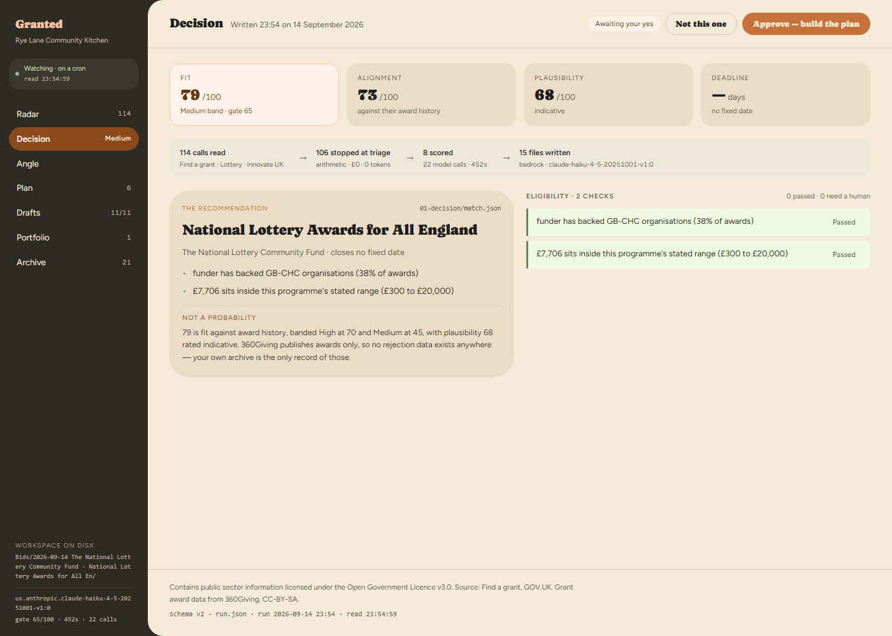
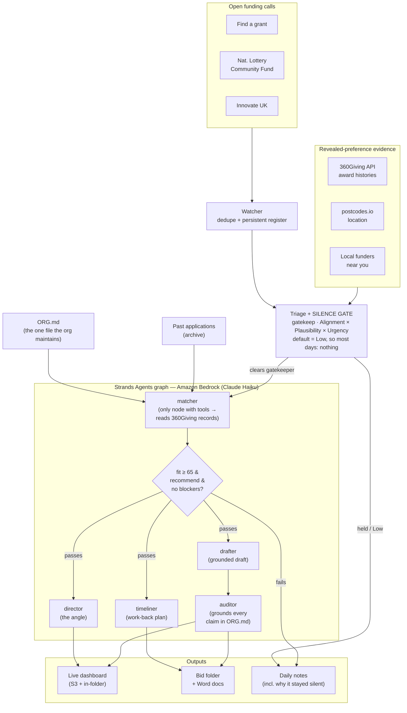

# Granted

A background agent that tells small UK organisations when **not** to apply for funding.



> Built with the **Strands Agents SDK** on **Amazon Bedrock** for the Agents for Humans hackathon. **[Live dashboard →](http://granted-dashboard-2026.s3-website.us-west-2.amazonaws.com)**

Most funding tools help you write more applications. Small charities do not have an
application-writing problem, they have a triage problem. A four-person food bank
spends thirty hours on a bid to a funder who has never, in nine hundred recorded
awards, funded an organisation of their legal form, in their region, at their size.
That week is gone and nobody told them beforehand.

Granted watches funding calls open and close, scores each one against what the
funder has demonstrably funded before, and stays silent. On most days it produces
nothing. When something genuinely fits, or when an application already in flight
falls behind, it surfaces once with a decision.

You maintain one file. `ORG.md`. That is the entire interface.

## Architecture



All five agents run on **Amazon Bedrock (Claude Haiku)** through the **Strands
Agents SDK**. The gate between the `matcher` and the three downstream agents is a
Strands `GraphBuilder` conditional edge: nothing past it executes unless a genuine
decision exists. **[Live dashboard](http://granted-dashboard-2026.s3-website.us-west-2.amazonaws.com).**

## Try it in two minutes (no AWS needed)

Everything except a live model call runs offline against prebuilt demo data.

```bash
git clone <this-repo> && cd granted
python -m venv .venv && source .venv/bin/activate   # Windows: .venv\Scripts\activate
pip install -e .
python scripts/preflight_offline.py                 # 30 checks, no AWS required
```

Then open a prebuilt run in a browser:

- `demo/runs/live/Granted/Dashboard.html` — the dashboard, as an organisation sees it
- or the **[live version on AWS](http://granted-dashboard-2026.s3-website.us-west-2.amazonaws.com)**

For a real run against Amazon Bedrock, add AWS credentials and run `granted run`
(details further down).

## Silence is the default

The brief for this agent was "runs autonomously and only surfaces when there's a
real decision to make." That is architecture here, not a claim.

The gate is a Strands `GraphBuilder` conditional edge. If the matcher does not clear
the fit threshold, nothing downstream executes and nobody is notified. The watcher
holds a persistent register of what it has already said, so an opportunity that has
not changed produces no output on the second run, or the tenth.

Two things surface: a new call that fits, and an in-flight application at risk.
Everything else updates state quietly.

## Triage

Every open call is scored High, Medium or Low on three inputs, combined deliberately
rather than averaged.

**Alignment** measures how well the organisation matches what this funder actually
buys: recipient legal forms, geographic concentration, award size band, and the
funder's own theme labels.

**Plausibility** measures resemblance to organisations they have funded, adjusted by
the organisation's own win rate from its archive. See the limitations section: this
is not a probability of success and is never presented as one.

**Urgency** is a multiplier and a veto, never a third addend. A poorly aligned call
closing on Friday is not High priority, it is a trap. A well-aligned call whose
remaining work no longer fits the time available is vetoed outright, with the hours
and the days both stated.

The default answer is Low.

## Why revealed preferences

A funding brief says who a funder would like to fund. Their award history says who
they actually fund. Granted reads the second, via the
[360Giving API](https://www.360giving.org/api-docs/):

- median and p10-p90 award size, so the ask is anchored in what they really give
- mean ratio of amount awarded to amount requested, where publishers report both
- which legal forms appear as recipients (GB-CHC, GB-COH, GB-SC)
- geographic concentration by recipient region
- the funder's own classification vocabulary, from their labels not their brochure
- repeat-funding rate, which tells a first-time applicant whether they have a chance

## Learning from your own archive

360Giving records who won. Your own filing cabinet records who lost, and that is the
only rejected-application data that exists anywhere in UK grantmaking.

Point Granted at your funding folder and it reads your past bids with their
outcomes: your own win rate, how successful asks differ in size from unsuccessful
ones, which funders declined you, and which funders said yes once and were never
approached again.

Sample sizes are small by nature. A five-year-old charity might have eighteen decided
applications. Output is labelled `anecdotal`, `indicative` or `reasonable`
accordingly, and never claims more than the sample supports.

## Scoped access, on purpose

Granted reads **one folder**, designated by you. Not your drive.

A charity's shared drive holds safeguarding records, referral notes and beneficiary
contact details. That is special category data under UK GDPR and no funding tool has
any business reading it. Files are skipped by name pattern even inside the designated
folder, symlinks out of the folder are refused, and every skip is logged and shown
back to you.

Broad OAuth access to Drive or SharePoint is listed as future work. The narrow
version is the better product regardless.

## ORG.md writes itself first

You do not fill in a form. Granted drafts `ORG.md` from what is already in your
archive, then asks only about what it could not find, ordered so that eligibility
blockers come first. A well-stocked folder turns a forty-question onboarding into
about six.

## Your voice, your authorship

Drafts are written in the organisation's own register, measured from their past
applications rather than assumed: sentence-length distribution and variance, person,
contraction rate, the exact word they use for the people they serve, their lexicon,
and their capitalisation habits. Where a past bid already says something well, the
sentence is reused verbatim rather than paraphrased.

This is fidelity, not disguise. A draft assembled from an organisation's own prior
sentences, grounded in their own file, genuinely is their writing. Granted
assists; the organisation is the author, and several UK funders now ask applicants
to declare AI assistance, which they should.

A mechanical post-pass flags machine tells, sentence-length uniformity against the
organisation's measured variance, and any substituted term.

## Everything is cited

Every figure in a draft resolves to a specific, checkable source:

| Kind | Locator |
| --- | --- |
| `org` | `ORG.md#L32`, with the verbatim line and its heading |
| `archive` | past bid, file and line, with that application's outcome attached |
| `360giving` | grant id, resolving to its GrantNav record |
| `external` | URL, with accessed date and the quoted figure |

An uncited figure never reaches the draft. It becomes a gap for a human to fill.
Drafts render twice: with footnotes for the trustee who wants to check a number, and
clean for pasting into a funder's portal.

## One folder per opportunity

When the gate fires, a workspace is created:

| Folder | Contents |
| --- | --- |
| `00-brief/` | the call as published |
| `01-decision/` | fit score, blockers, suggested ask, reasoning |
| `02-direction/` | the angle to lead with, and what to avoid |
| `03-drafts/` | answers, versioned |
| `04-evidence/` | every cited figure with its source |
| `05-timeline/` | work-back schedule with owners and review points |
| `06-submitted/` | what went in, and the result |

`06-submitted/outcome.meta.json` is written blank at creation. When someone spends
thirty seconds filling it in, next year's archive learner gets clean data for free.
The system improves with use instead of decaying.

## Install it for an organisation

Granted ships as one folder an organisation unzips into its own files, next to
the funding folder it already keeps. `python scripts/make_release.py` builds it:

```
Granted/
  START HERE.txt                    what to do, in plain words
  Install Granted (Windows).bat     double-click; ./install.sh on Mac and Linux
  .granted/app/                     the program
```

The installer finds Python (on Windows it offers to install it), puts the program
in the user's local app data rather than the shared folder, and asks how to reach
the model: an Anthropic API key or an AWS account. The key is kept on the machine,
outside the folder, because a shared folder is the wrong place for one. It then
asks for the organisation's name and where its past applications are, runs
`granted setup` to draft ORG.md from them, and can schedule a run every morning.

After that the folder is the whole product:

| In the folder | What it is |
| --- | --- |
| `Dashboard.html` | the dashboard, the same design as the live page; opens with a double-click and picks up each new run within a minute |
| `Bid folders.html` | every bid folder and its files at a glance; works offline |
| `Bids/` | one folder per call worth the time, named by date, funder and programme |
| `Daily notes/` | what each run looked at, and why it stayed quiet |
| `Past applications/` | the archive, unless `granted.json` points at an existing folder |
| `ORG.md` | the one file the organisation maintains |
| `granted.json` | settings: name, archive, where calls come from |
| `funders.json` | funders whose award histories can be scored |
| `.granted/` | the program, the register and the run record |

Inside each bid folder the decision, the angle, the draft, the evidence and the
timeline each get a Word copy beside the plain-text original, because Word is
where a trustee edits and a coordinator pastes from. Past applications are read
from Word, PDF or text.

Every path is relative, so the folder can sit in OneDrive or SharePoint and be
moved. `granted run` inside it needs no options; `granted run --home <folder>`
works from anywhere, and is what the scheduled task calls.

## National, regional and local

Every call is checked against where the organisation is before anything else, for
free: a Scotland-only programme never reaches a London charity. The place comes from
a postcode in ORG.md, looked up through postcodes.io (ONS and Ordnance Survey data);
without one, the "Area served" line is read from its widest place inwards, so the
Easton in Bristol is not mistaken for one of the other Eastons. Business-only
competitions are ruled out for charities the same way.

Local money is mostly in community foundations, councils and the regional programmes
of the lottery distributors, and none of them list open calls in one place. So once a
week Granted reads the recent awards of every such funder that publishes to 360Giving,
and lists the ones that have actually funded organisations near you, how often and at
what size. It appears in the daily note and on the dashboard: a list worth a look,
not a decision.

## Architecture

```
  archive ──┐
            ├──▶  precedent  ──▶  triage  ──▶  matcher
  watcher ──┘                                    │
                        ┌──────────────────────  ┴──────────────┐
              gate fires│                                       │gate does not fire
                        ▼                                       ▼
           director · timeliner · drafter                    silence
                                  │                        (no output,
                                  ▼                      no notification,
                              auditor                     run ends here)
                                  │
                                  ▼
                        workspace + one digest
```

## Modules

| Module | Responsibility |
| --- | --- |
| `run.py` | one run end to end: calls, triage, graph, digest, run record |
| `sources.py` | Find a grant, National Lottery Community Fund and Innovate UK: open calls, deadlines, eligibility, award ranges |
| `digest.py` | writes the run record on every run (`data/run.json`, or `.granted/run.json` in a Granted folder) |
| `render.py` | the digest a person reads: terminal, markdown and JSON |
| `dashboard.py` | the folder's own dashboard, rebuilt from what is on disk, data built in |
| `home.py` | the Granted folder: layout, `granted.json`, `granted setup`, credentials outside the folder |
| `documents.py` | reads Word, PDF and text; writes Word; standard library apart from PDF |
| `paperwork.py` | the Word copies in each bid folder |
| `location.py` | the organisation's place from its postcode or area, in the labels calls use |
| `criteria.py` | the free location and eligibility check on every call; stated-criteria scoring |
| `local.py` | funders active near you, from 360Giving award histories, rebuilt weekly |
| `precedent.py` | 360Giving client, rate limited; revealed-preference analysis |
| `archive.py` | scoped folder scan, sensitive-file exclusion, own track record |
| `interview.py` | bootstrap `ORG.md` from archive, prioritise the remaining gaps |
| `triage.py` | alignment, plausibility, urgency; High/Medium/Low with feasibility veto |
| `watcher.py` | opportunity register with memory, lifecycle states, timeline drift |
| `voice.py` | style card measured from corpus, mechanical tell and uniformity check |
| `citations.py` | four source kinds with resolvable locators, footnote rendering |
| `workspace.py` | per-opportunity folders and the outcome stub |
| `graph.py` | Strands Graph with the silence gate as a conditional edge |
| `schemas.py` | structured outputs |

## What this does not do

Stated plainly, because these limitations are real and a reader should hear them
here rather than discover them.

**It does not predict success.** 360Giving publishes awards. There is no open record
of rejected applicants anywhere in UK grantmaking. Any tool claiming to predict
whether an application will win is selecting on the dependent variable. Granted
reports resemblance to actual recipients and the organisation's own win rate, both
with sample sizes attached, and calls it plausibility rather than probability.

**It does not copy winning applications.** Winning application text is not public.
The data supports a base rate, not a template. This is deliberate: a tool that helped
every small charity write the same bid would make the sector worse.

**Triage thresholds are heuristic and uncalibrated.** The High and Medium cut-offs,
the alignment and plausibility weighting, and the deadline multiplier bands are
reasoned starting points, not fitted parameters. They need tuning against a real
distribution of opportunities.

**Funding-call coverage is partial.** Live calls come from three sources:
[Find a grant](https://www.find-government-grants.service.gov.uk/), the GOV.UK service
listing around 120 open government grants (Open Government Licence v3.0); the
[National Lottery Community Fund](https://www.tnlcommunityfund.org.uk/funding/funding-programmes)'s
open programmes; and [Innovate UK](https://apply-for-innovation-funding.service.gov.uk/competition/search)'s
competitions. Trusts, foundations and councils have no shared listing of open calls,
so Granted names the ones that fund near you (see below), and their calls go in a
calls file by hand. Commercial aggregators exist and are out of scope.

**Some calls can only be judged on what they say.** Triage prefers a funder's award
history: `funders.json` maps ten government funders to theirs, and the National
Lottery Community Fund publishes its own. Most Find a grant funders, and Innovate UK,
publish none, and the 360Giving API cannot look a funder up by name. Those calls are
judged on their stated criteria instead: where they apply, who can apply, award size
against the organisation's income, and whether the call is about what it does. Every
such verdict is labelled "stated criteria", because it is thinner evidence than an
award history, and the promising ones reach the model with that said plainly.

**Award data is incomplete.** Only funders publishing to the 360Giving Data Standard
appear. Coverage is good for lottery distributors, community foundations and
government departments, and patchy for small trusts.

**Cold start.** An organisation with no bid archive gets no style card and no track
record. Triage still works from funder data alone, and says so.

## The dashboard reads real output

Every run writes a run record through `granted.digest`: `data/run.json` in a run
folder, `.granted/run.json` in a Granted folder. Silent runs are
included: a page that only changes when something surfaces cannot tell a quiet day
from a dead agent. Every figure the dashboard displays is computed by a module, and
the file names which one under `_produced_by`. Nothing on screen is hand-entered.

The dashboard is one static file, `Granted Dashboard Design/dist/index.html`,
which polls `run.json` beside it. To put both on an S3 static site:

```bash
python scripts/publish.py --bucket granted-dashboard-2026 --setup    # once; the bucket is public-read
python scripts/publish.py --bucket granted-dashboard-2026 \
    --dashboard "Granted Dashboard Design/dist/index.html"
python scripts/publish.py --bucket granted-dashboard-2026 --run out/data/run.json   # after each run
```

A scheduled run followed by that last line is the whole live mechanism. The page
never calls Find a grant or 360Giving itself; neither sets CORS headers.

That is the page to publish. Every Granted folder also gets its own copy as
`Dashboard.html`. A page opened from disk may not fetch a file, but it may load a
script, so each run writes `.granted/run.js` beside `run.json` and the page reloads
it every minute: an open dashboard shows a scheduled run without being reopened.
It loads React from a CDN, so it needs an internet connection; `Bid folders.html`,
which lists every bid folder and its Word files, does not.

## Data and attribution

Open funding calls from Find a grant, GOV.UK. Contains public sector information
licensed under the Open Government Licence v3.0.

Grant award data from [360Giving](https://www.360giving.org/), licensed CC-BY-SA. The API
requires no authentication and is rate limited to two requests per second; this
client respects that. Data is updated daily and subject to take-down requests, so
nothing is cached beyond one day.

## Setup

```bash
python -m venv .venv && source .venv/bin/activate
pip install -e .

aws configure                        # or set AWS_PROFILE / AWS_REGION
python scripts/preflight.py          # verifies credentials, model, structured output, gate

python scripts/preflight_offline.py  # everything that needs no AWS

python scripts/make_synthetic_archive.py --out fixtures/easton-funding
cp ORG.example.md ORG.md             # then edit, or let the interview draft it

# one funder's calls, from a file
python -m granted.run --funder GB-CHC-274100 --calls demo/calls.json \
    --org ORG.md --archive fixtures/easton-funding --out out

# live calls from all three sources
python -m granted.sources --check # do the listings still parse?
python -m granted.run --calls find-a-grant,national-lottery,innovate-uk \
    --org ORG.md --archive fixtures/easton-funding --out out

# the folder an organisation downloads
python scripts/make_release.py      # release/Granted/ and release/Granted.zip
```

Run `scripts/preflight.py` before anything else. It checks the five things that
break first, in the order they break, and prints the likely cause for each.

### Models

Bedrock cross-region inference profile IDs, not bare model IDs. A bare id such as
`anthropic.claude-haiku-4-5` returns a 403 that reads like a permissions failure
but is only a malformed identifier.

| Mode | Model |
| --- | --- |
| `GRANTED_MODE=dev` (default) | `us.anthropic.claude-haiku-4-5-20251001-v1:0` |
| `GRANTED_MODE=demo` | `us.anthropic.claude-sonnet-4-5-20250929-v1:0` |

`GRANTED_MODEL` overrides both. Development runs on Haiku so that credit goes
on volume of testing rather than model tier.

### Providers

Bedrock is the target. Strands is provider-agnostic, so the same graph also runs
against the Anthropic API, which means development is never blocked on AWS account
activation:

```bash
export GRANTED_PROVIDER=anthropic
export ANTHROPIC_API_KEY=...
pip install 'strands-agents[anthropic]'
```

Unset `GRANTED_PROVIDER` to go back to Bedrock. No code changes either way.

## Licence

MIT. See `LICENSE`.
